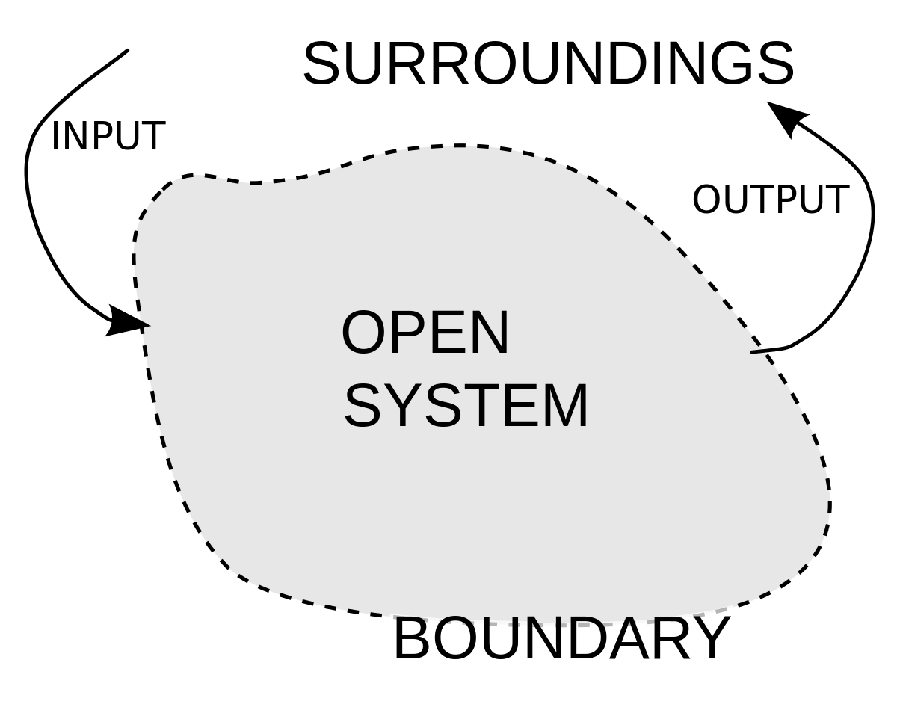
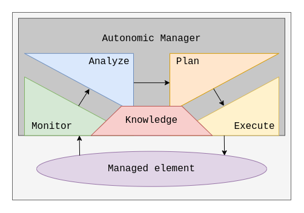
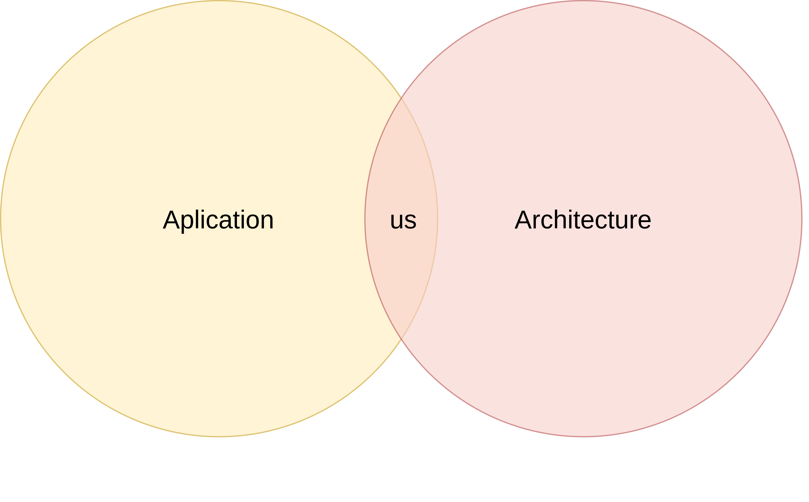
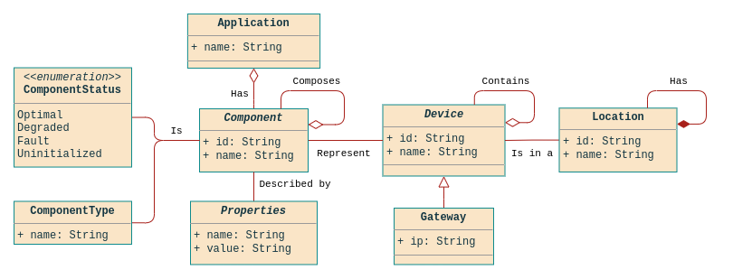
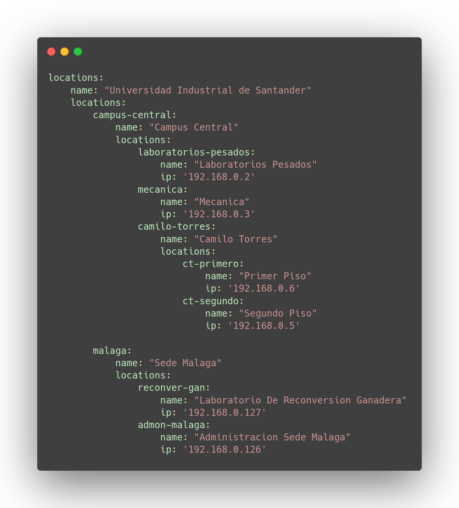
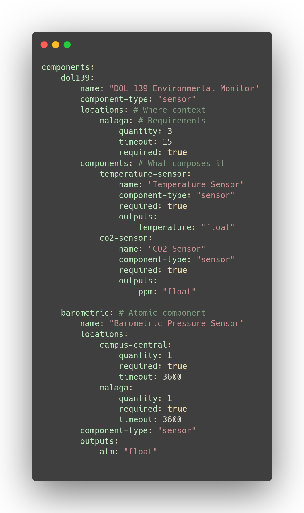

<!-- backgroundColor: #67B93E  -->
<!-- color: white  -->

<h1 style='text-align: right; font-size: 1.5em;'> 
  Autonomic Software Architecture Adaptation Mechanisms for Smart Campus UIS
</h1>

 Daniel David Delgado Cervantes 

---

## Context
Covering some background

---

### Smart Campus
Smart Cities at a smaller scale

<!-- If they know the context, might a as well skip this one -->
<!-- 
  Smart Campuses refer to the integration of IoT technologies in order to integrate the physical structure of Institutions, such as this one, in order to improve the overall experience of people in Campus. 
  
  They have several applications that range from offering students services access to administrative services and information to the monitoring of areas for security or environmental purposes. This is mainly achieved with IoT applications that serve those needs.

  The more systems grow and expand, they're harder to manage as both the technical and human resources required to maintain them increases. This complexity can come from the amount of individual parts that compose the systems or the delicate balance of resources that they require to be operational.

  In the case of smart campuses, this can happen both due to the requirements that need to be met, the interactions with the physical world or the way things are distributed across the campus.
-->

---

### Autonomic Computing
Managing Systems can get complicated

<!--  
    This is where the concept of self-managed systems comes to play. The main idea, initially conceived by IBM, is to create systems with the capabilities and tools required to adapt their architecture and configurations in order to achieve some sort of high level goal set by the system administrators.
-->

---

### The MAPE-K Cycle
**M**onitor, **A**nalyze, **P**lan, **E**xecute And **K**nowledge

<!--  
    There are several approaches to the implementation of Autonomic and self-managed systems. One of them is the MAPE-K Cycle. As described by IBM, it refers to each of the stages the systems should go through in order to adapt themselves to achieve a given goal.

    Monitor: Expand the knowledge base about the self and the surroundings
    Analyze: Evaluate the problems
    Plan: Generate a solution 
    Execute: Apply what has been planned 
-->

---

## The Project

What are we doing?

---

### Smart Campus UIS
Adding some Autonomic Properties

<!--  
    As stated by the title, our main goal is the implementation of Autonomic Mechanisms that allow us to manipulate the architecture of Smart Campus UIS applications to comply with a given objetive by the system administrator.
-->

---

## The Notation
Building the knowledge base 

--- 

### The Notion of Application
What are we targeting?

 

---

### Abstraction
What we're working with

---

### The Syntax
Made of 2 parts

---

### The Syntax: Locations
The Geographical Context

---

### The Syntax: Components
What ~~dreams~~ applications are made of

---

### A Short Example

---

### A Short Example

